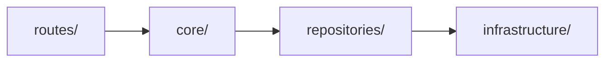

## Steps

### 1. Avoid Generic Nomenclature

Generic names like `Service`, `Utility`, `Manager`, or `Helper` are a code
smell. They show the class has no clear responsibility. This breeds God
Objects and code that no one can safely change.

**Always prefer a specific, intent-revealing name based on a Gang of Four
pattern.**

Python has module-level functions. A class that only holds static methods is
not a pattern. It is a namespace. Use a module instead. See the
`naming-conventions` skill, step 6.

### 2. Pattern Reference

| Pattern        | Purpose                                          | When to Use in This Repo                                      |
| -------------- | ------------------------------------------------ | ------------------------------------------------------------- |
| **Adapter**    | Convert one interface into another               | Mapping AG-UI messages to OpenAI messages                     |
| **Gateway**    | Encapsulate access to an external system         | Wrapping the LiteLLM, Qdrant, or Langfuse API                 |
| **Repository** | Persist and retrieve domain objects              | Any SQLAlchemy or Qdrant read/write                           |
| **Pipeline**   | Run an ordered set of stages over one input      | Retrieve, rerank, then generate                               |
| **Facade**     | Give one simple interface to a complex subsystem | Hiding Docling's converter and chunker behind one entry point |
| **Proxy**      | Stand in for an expensive object                 | Caching search results, lazy-loading a model                  |
| **Strategy**   | Swap interchangeable algorithms at runtime       | Choosing a reranker or an embedding provider                  |
| **Factory**    | Create objects without naming the exact class    | `build_*_client()` functions in `infrastructure/`             |
| **Provider**   | Supply an instance or computed state             | FastAPI dependencies in `dependencies.py`                     |
| **Observer**   | Notify many subscribers of a change              | Fanning out run events to listeners                           |
| **Decorator**  | Add behavior around an existing object           | Retry, tracing, or rate limiting around a client              |
| **Chain**      | Pass a request through a series of handlers      | ASGI middleware, multi-stage document processing              |
| **Builder**    | Construct a complex object step by step          | Assembling a LangGraph graph or a Qdrant filter               |
| **Command**    | Wrap a request as an object                      | A queued embedding job                                        |
| **Mediator**   | Coordinate how several objects interact          | Orchestrating multiple agents                                 |

### 3. Decision Tree for Naming

Ask these questions in order.

1. **Does it read or write persistent data?** → **Repository**
   (`PostgresDocumentRepository`, `PostgresPiiVaultRepository`)
2. **Does it talk to an external system over the network?** → **Gateway** or
   **Index** (`QdrantEmbeddingIndex`, `LiteLlmGateway`)
3. **Does it run ordered stages over one input?** → **Pipeline**
   (`RagPipeline`)
4. **Does it construct a client or resource?** → a `build_*` **Factory**
   function (`build_postgres_engine`, `build_qdrant_client`)
5. **Does it convert one shape into another?** → **Adapter** or a `to_*`
   function (`_to_openai_messages`)
6. **Does it select an algorithm at runtime?** → **Strategy**
   (`CrossEncoderReranker`, `LexicalOverlapReranker`)
7. **Does it supply a dependency to a route?** → **Provider**
   (`get_document_repository`)
8. **Does it add behavior around an existing object?** → **Decorator**
9. **Does it wrap a queued unit of work?** → **Command** or **Worker**
   (`EmbeddingWorkerPool`)
10. **Does it hide a complex subsystem?** → **Facade**

If none fit, the class is mixing concerns. Split it.

### 4. Naming Examples

| Bad (Generic)         | Good (Pattern-Based)         | Pattern    |
| --------------------- | ---------------------------- | ---------- |
| `VectorService`       | `QdrantEmbeddingIndex`       | Repository |
| `DocumentManager`     | `PostgresDocumentRepository` | Repository |
| `RagService`          | `RagPipeline`                | Pipeline   |
| `EmbeddingHelper`     | `EmbeddingClient`            | Gateway    |
| `RerankUtil`          | `CrossEncoderReranker`       | Strategy   |
| `LlmService`          | `AnswerGenerator`            | Gateway    |
| `PiiUtils`            | `PiiMasker`                  | Facade     |
| `DbConnectionManager` | `build_postgres_engine`      | Factory    |
| `WorkerManager`       | `EmbeddingWorkerPool`        | Command    |
| `ChatService`         | `run_chat_agent`             | (function) |

### 5. Respect the Layer Boundaries

The pattern name must match the layer the class lives in.



| Layer             | Allowed patterns                    | Never                      |
| ----------------- | ----------------------------------- | -------------------------- |
| `routes/`         | thin handlers only                  | business logic, SQL        |
| `core/`           | Pipeline, Strategy, Facade, Adapter | direct client construction |
| `repositories/`   | Repository, Index                   | HTTP concerns              |
| `infrastructure/` | Factory functions, Gateway          | domain rules               |

Never import in the other direction. `core/` must not import from `routes/`.

### 6. Prefer a Library-Generated Definition Over Hand-Written Boilerplate

Before you hand-write a schema, a registry dict, or another structure that
just restates a function's own signature, check whether an installed library
already builds that structure from typed, documented code. A hand-written
copy can drift from the code it describes. A library-generated one cannot.

**Example**: `voice_agent_tools.py` once hand-wrote a `TOOL_SCHEMAS` list of
raw JSON Schema dicts, next to a `_handlers` dict, next to six handler
methods. Three structures held the same facts, and nothing kept them in
sync. LangChain's `@tool` decorator (already a dependency in this repo)
reads a function's own docstring and type hints and builds the schema from
them. The decorated function is itself the handler, so one definition now
does the job of all three.

| Bad (Hand-Rolled)                                    | Good (Library-Generated)                                          |
| ----------------------------------------------------- | ------------------------------------------------------------------ |
| A hand-written JSON Schema dict for a tool call        | `@tool` (`langchain_core.tools`) or `pydantic_function_tool` (`openai`) |
| A hand-written JSON Schema for a Pydantic-shaped value | `Model.model_json_schema()`                                        |
| A name-to-handler dict kept in sync with a schema list | The library object that already carries both, keyed by `.name`     |

Reach for a hand-written structure only when no installed library covers the
case. Check `pyproject.toml` first — the repo may already depend on a
library that solves it.

### 7. In Specs: Component Design Template

When you propose a new class in a spec, use this template.

```markdown
### Component: [PatternBasedName]

**Pattern**: [Pattern name from Gang of Four]
**Layer**: [routes | core | repositories | infrastructure]
**Responsibility**: [What it owns]
**Delegates**: [What it does not own]
**Rejected alternatives**:

- [GenericServiceName] (generic, unclear responsibility)
- [WrongLayerName] (belongs in a different layer)
```
