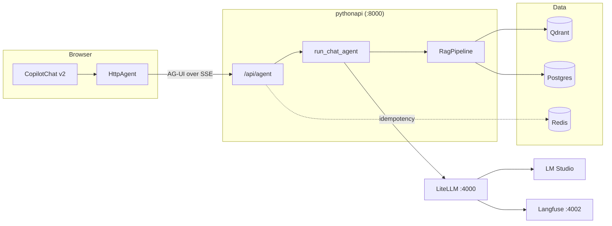
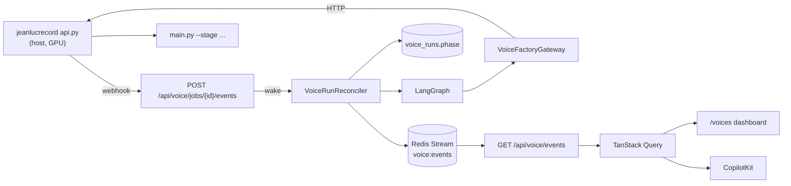

# CLAUDE.md — copilot_agent_network

Nx monorepo. A Next.js chat front end talks to a Python FastAPI agent service
over the AG-UI protocol. The service runs a RAG pipeline over Qdrant and
Postgres, and routes every model call through LiteLLM.

---

## Critical Rules (Always Active)

1. **ASK BEFORE CHANGES** — Never make code changes without user confirmation
2. **ALWAYS EVAL FOR SKILLS** — Before every task, check whether a skill below applies and read it if so. Do NOT read skills by default, but do NOT skip this evaluation.
3. **ALWAYS ASK BEFORE SEARCHING** — Before endlessly searching ask where files and features are located if a grounded starting point is not provided.
4. **PLAIN ENGLISH OUTPUT** — Write all output (chat, comments, commits, PRs, specs, UI text) per ASD-STE100: short sentences, active voice, one idea per sentence, no jargon. See `asd-ste100` skill.
5. **SQLALCHEMY ONLY** — All Postgres access uses SQLAlchemy 2.0 async. Never write raw SQL.
6. **NEVER RUN LINT/TEST/BUILD** — Never call `nx lint`, `nx test`, `nx run pythonapi:format`, `nx build`, or any test runner directly. Hand the task to `litert-subagent` and read back only its final result line.

---

## Skills

| Skill                | Path                                         | When to apply                                     |
| -------------------- | -------------------------------------------- | ------------------------------------------------- |
| `diagrams`           | `.claude/skills/diagrams/SKILL.md`           | Any diagram, flowchart, or architecture doc       |
| `naming-conventions` | `.claude/skills/naming-conventions/SKILL.md` | Writing or reviewing any identifier names         |
| `gof-patterns`       | `.claude/skills/gof-patterns/SKILL.md`       | Designing classes or choosing structural patterns |
| `asd-ste100`         | `.claude/skills/asd-ste100/SKILL.md`         | Chat, comments, commits, PRs, specs, UI text      |
| `litert-subagent`    | `.claude/skills/litert-subagent/SKILL.md`    | Lint, test, build tasks; local model inference    |

## Agents

| Agent           | Path                              | When to apply                                           |
| --------------- | --------------------------------- | ------------------------------------------------------- |
| `code-reviewer` | `.claude/agents/code-reviewer.md` | Non-trivial diffs — naming, patterns, async correctness |

---

## Quick Reference

| Rule               | Summary                                                         |
| ------------------ | --------------------------------------------------------------- |
| PYTHON = PEP 8     | `snake_case` functions and variables, `PascalCase` classes      |
| TYPESCRIPT = CAMEL | `camelCase` variables, `PascalCase` components and types        |
| NO ABBREVIATIONS   | `cancellation_token` not `ct`, `configuration` not `cfg`        |
| NO MAGIC STRINGS   | Config → `Settings` in `config.py`, UI text → module constants  |
| ENUMS NOT STRINGS  | `Literal` types or `enum.Enum`, never bare string comparison    |
| PATTERN NAMES      | `QdrantEmbeddingIndex` not `VectorService`                      |
| MERMAID ONLY       | No ASCII box art for diagrams                                   |
| ASYNC ALL THE WAY  | No blocking calls in an `async def`. No sync driver in a route. |
| SQLALCHEMY ONLY    | No raw SQL strings anywhere                                     |
| PLAIN ENGLISH      | ASD-STE100: short sentences, active voice                       |

---

## Architecture

The browser talks to FastAPI directly. There is no CopilotKit runtime and no
Next.js proxy route in between.



**Key contracts:**

- `apps/pythonapi/pythonapi/routes/agent.py` is the only contract between the
  two apps. It accepts a `RunAgentInput` and returns AG-UI events over SSE.
- The front end uses `@copilotkit/react-core/v2`. The v1 remote-endpoint
  protocol is not used. The Python `copilotkit` SDK is deliberately absent.
- Every model call goes through LiteLLM at `LLM_BASE_URL`. Never call a model
  provider directly.
- Qdrant holds chunk vectors only. Postgres holds all document, chunk, and
  order metadata.

---

## Tech Stack

| Layer         | Technology                                                       |
| ------------- | ---------------------------------------------------------------- |
| Monorepo      | Nx 23, pnpm 11 (JS/TS), uv (Python), `@nxlv/python` plugin       |
| Front end     | Next.js 16, React 19, CopilotKit v2 (`react-core/v2`), AG-UI     |
| API           | FastAPI, Pydantic Settings, uvicorn                              |
| Agents        | AG-UI protocol, LangChain, LangGraph (planned), BAML             |
| Model gateway | LiteLLM → LM Studio (OpenAI-compatible)                          |
| Vectors       | Qdrant (dense + sparse BM25 via fastembed)                       |
| Relational    | Postgres 16, SQLAlchemy 2.0 async, asyncpg                       |
| Cache         | Redis 7 (idempotency, rate limits)                               |
| Tracing       | Langfuse v2                                                      |
| Documents     | Docling (parsing + hybrid chunking)                              |
| PII           | Presidio analyzer/anonymizer, encrypted vault                    |
| Tests         | pytest + pytest-asyncio (Python), Jest (React), Playwright (e2e) |
| Lint / format | Ruff (Python), ESLint + Prettier (TS)                            |

---

## Codebase Layout

```
apps/
├── agentic-executor/            # Next.js 16 front end (port 4001)
│   ├── specs/                   # Jest component tests
│   └── src/
│       ├── components/ui/       # shadcn (base-mira on Base UI, hugeicons)
│       └── app/
│           ├── layout.tsx       # QueryProvider + CopilotProvider + nav
│           ├── page.tsx
│           ├── voices/          # HIL dashboard for the TTS pipeline
│           └── features/        # Domain UI, grouped by feature
│               ├── chat/        # copilot_provider.tsx, chat_window.tsx
│               └── voices/      # voice_api.ts, speaker_board.tsx, ...
├── agentic-executor-e2e/        # Playwright end-to-end tests
└── pythonapi/                   # FastAPI service (port 8000)
    ├── baml_src/                # BAML source: clients, generators, rag
    ├── tests/                   # pytest suite
    └── pythonapi/
        ├── main.py              # App assembly only — lifespan, middleware, routers
        ├── config.py            # Settings (pydantic-settings). All env vars land here.
        ├── dependencies.py      # FastAPI DI providers
        ├── baml_client/         # GENERATED — never edit, run `nx baml-generate pythonapi`
        ├── core/                # Business logic, no HTTP and no I/O clients
        │   ├── chat_agent.py    # AG-UI event stream for one agent run
        │   ├── rag_pipeline.py  # Retrieve → rerank → generate
        │   ├── embeddings.py, reranking.py, generation.py
        │   ├── document_parsing.py, pii.py
        │   ├── voice_factory_gateway.py   # Calls the voice factory host
        │   ├── voice_pipeline_graph.py    # LangGraph, one node per phase
        ├── infrastructure/      # External client builders — one per system
        │   ├── postgres_client.py, qdrant_client.py
        │   ├── redis_client.py, langfuse_client.py
        ├── repositories/        # Persistence — SQLAlchemy and Qdrant only
        │   ├── postgres.py, qdrant.py, orders.py
        │   ├── pii_vault.py, memory.py, base.py
        ├── models/              # Pydantic schemas + SQLAlchemy ORM (orm.py)
        ├── routes/              # HTTP layer — thin, delegates to core/
        │   ├── agent.py         # AG-UI SSE endpoint
        │   ├── documents.py, search.py, orders.py
        │   ├── health.py, openai_proxy.py
        ├── middleware/          # idempotency.py
        └── workers/             # embedding_worker.py — background embed pool
                                 # voice_run_reconciler.py — advances runs
```

> `baml_client/` is generated from `baml_src/`. Regenerate it. Never hand-edit it.
> Layer rule: `routes/` → `core/` → `repositories/` → `infrastructure/`.
> Never import in the other direction.

---

## Voice Model Pipeline

`/api/voice` turns a YouTube video into a fine-tuned Piper text-to-speech model.
The pipeline itself lives in a **separate repository**, `star-trek-voyicer`.

**Why it is split.** Training needs an NVIDIA GPU and Docker. The `pythonapi`
container pins CPU-only torch and has no GPU access. So the pipeline runs on the
host and this service orchestrates it over HTTP.

Nothing polls. The factory pushes job changes over a webhook, and the browser
holds one SSE connection.



**Key rules:**

- `VOICE_FACTORY_URL` points at the control API. Unset, every `/api/voice` route
  answers 503 and the reconciler never starts. Nothing else is affected.
- The `voice_runs.phase` column **is** the state machine. There is no LangGraph
  checkpointer. A run must survive a restart, because training takes days and a
  human review can sit longer.
- `VoiceRunReconciler` is the only writer of run phases. The webhook reports a
  change and calls `wake(run_id)`; it never decides what the phase becomes. So a
  lost webhook costs latency only - the reconcile timer is the backstop.
- Redis carries events, never state. Losing Redis loses live updates and nothing
  else, so a publishing failure is logged and swallowed. The Redis Stream ID is
  the event ID and the SSE `id:`, which is why there is no sequence column.
- Every SSE event carries the complete `VoiceRun`, never a patch. Applying one
  twice lands on the same result, which is what makes reconnect replay cheap.
- Several API instances can run at once. `voice_runs.leased_until` and
  `lease_owner` are the mutual exclusion, claimed in one atomic UPDATE. The
  lease expires on its own, so a dead instance never strands a run.
- A transient factory error (refused, timed out, 5xx) holds the phase and bumps
  `error_count`. Only `VOICE_MAX_CONSECUTIVE_ERRORS` in a row fail the run, and
  `POST /api/voice/runs/{id}/retry` puts it back in `failed_from_phase`.
- `AWAITING_REVIEW` is the only transition a person makes. The reconciler skips
  that phase, plus `READY` and `FAILED`.
- `review.csv` on the voice factory host stays the one source of truth for clip
  decisions. This service stores run state and nothing on disk.
- Training logs stay off the event stream. `GET /runs/{id}/logs` serves them, so
  every browser does not pay for output one screen reads.
- The browser never calls the voice factory. Clip audio proxies through
  `/api/voice/runs/{id}/clips/{clip}/audio`, so there is one origin and one CORS
  entry.

`voice_runs` gained columns for this change. The project uses
`Base.metadata.create_all`, which does not migrate an existing table, so drop
and recreate it in development. Alembic is a separate task.

To run the control API, in the `star-trek-voyicer` repo:

```powershell
just serve-jeanlucrecord    # http://127.0.0.1:8100
```

Set `VOICE_ORCHESTRATOR_WEBHOOK_URL` and `VOICE_WEBHOOK_TOKEN` there to turn
webhooks on. The token must match `VOICE_WEBHOOK_TOKEN` here. Leave the URL
unset and the factory behaves exactly as before.

---

## Build & Test

Claude does not run these directly (Critical Rule 6). See `litert-subagent`,
which executes and fixes these on Claude's behalf. This table is the task
reference the subagent's `run_ci_task.py` script reads from.

Run from the repo root. Use **PowerShell**.

```powershell
# Full stack in Docker
nx up apps            # build and start every container
nx watch apps         # dev stack with live sync
nx down apps          # stop the stack

# Python API
nx serve pythonapi    # uvicorn on :8000
nx test pythonapi     # pytest with coverage
nx lint pythonapi     # ruff check
nx run pythonapi:format  # ruff format. NOT `nx format pythonapi` - see below
nx baml-generate pythonapi

# Front end
nx dev @agentic-executor/agentic-executor
nx lint @agentic-executor/agentic-executor       # eslint
nx typecheck @agentic-executor/agentic-executor  # tsc, no emit
nx test @agentic-executor/agentic-executor
nx e2e agentic-executor-e2e

# Whole workspace — every project nx knows about, Python and TS alike.
# A project missing a target (pythonapi has no typecheck) is skipped, not
# treated as a failure.
nx run-many -t lint test typecheck
nx affected -t lint test typecheck

# Prettier over every non-Python file in the repo. Workspace-wide by design.
nx format
```

> **`format` is an Nx built-in, so a project name does not scope it.**
> `nx format pythonapi` runs prettier over the whole workspace and ignores
> the word `pythonapi`. The project's own ruff target is shadowed by the
> built-in and is only reachable as `nx run pythonapi:format`. The same trap
> applies to `format:check`, `repair`, `migrate`, and `reset`.
>
> `.gitattributes` pins the working tree to LF, which is what keeps `nx format`
> idempotent. Without it, prettier writes LF over a CRLF checkout and every
> file in the repo shows as modified with no content change.

**Dependencies:**

```powershell
pnpm add -w <package>                    # JS/TS at the root
nx add pythonapi --name <package>        # Python, updates uv.lock
```

**Ports:** web 4001 · pythonapi 8000 · LiteLLM 4000 · Langfuse 4002 ·
Qdrant 6333 · Redis 6379

---

## Conventions

### Configuration

**Defaults live in `config.py`. An environment variable is an override, never
a requirement.** The service must boot with no environment file at all.

Three locations, one name: the repo root (shared values and secrets),
`apps/pythonapi/`, and `apps/agentic-executor/`. Each holds an `.env.example`
twin of two runtime files:

- `.env` — the production pipeline.
- `.env.local` — development, `nx up apps`, and `nx watch apps`.

Compose lists both with `env_file:` and marks each `required: false`. A later
file wins, so `.env.local` overrides `.env`. Neither has to exist.

`--env-file` cannot be optional, so the Nx targets in `project.json` carry two
configurations. `local` is the default and reads `.env.local`. `production`
reads `.env`, as in `nx up apps:production`. Those flags feed compose
interpolation, which the LiteLLM and Langfuse blocks and the
`NEXT_PUBLIC_PYTHON_API_URL` build arg all need.

- **To add a setting: add the field to `Settings` with a real default. Stop
  there.** Add a key to an env file only when Docker needs a different value.
  A key that repeats the default creates the second copy this layout removes.
- Never write a bare `= None` default. A missing variable then reaches its
  consumer as None and fails at the call site, far from the cause. `None` is
  correct only for secrets and for integrations where it means "feature off".
  `tests/test_config.py` enforces this and holds the allow-list.
- The root `.env.local` sets `NX_LOAD_DOT_ENV_FILES=false`. Nx loads both
  `.env.local` and `.env` from the workspace root, so the name hides nothing.
  Without the flag `nx test pythonapi` inherits the compose host names and
  hangs on `redis` and `pythonapi-db`.
- Next.js reads `apps/agentic-executor/.env.local` before `.env`, and ignores
  `.env.local` when `NODE_ENV` is `test`. `nx dev` and Jest need no extra flag.
- Keep an optional key commented out to leave it unset. An empty value differs:
  `Settings` reads `EMBEDDING_DIM=` as `""` and fails to parse it.
- Only LiteLLM and Langfuse keep an `environment:` block. They need renamed
  keys and `env_file:` passes names verbatim. Do not add app settings there.
- `config.py` sets no pydantic `env_file` on purpose. A dotenv path would
  resolve against the process CWD, not the package. Compose does the injecting.

### Python

- Every I/O path is `async`. Repositories, routes, and clients all use
  `async def`.
- Build external clients once in `lifespan()` and store them on `app.state`.
  Never build a client per request.
- Optional integrations degrade, they do not crash. Redis, Langfuse, and
  Postgres may all be unset. Qdrant always works through embedded `:memory:`.
- Settings are `UPPER_SNAKE_CASE` fields on the `Settings` class. Read them
  from `settings`, never from `os.environ`.
- Ruff enforces line length 88 and import order. Run `nx run pythonapi:format`
  before you commit.

### TypeScript / React

- Server Components by default. Add `"use client"` only when the component
  needs state, effects, or browser APIs.
- File names are `snake_case.tsx`. Exported component names are `PascalCase`.
  Example: `chat_window.tsx` exports `ChatWindow`.
- Group by feature under `src/app/features/<feature>/`.
- Build the `HttpAgent` at module scope, not inside a render.

### Comments

Write a comment only when the reason is not obvious from the code. Explain
**why**, never **what**. The existing comments in `main.py` and `config.py`
are the model to follow.

---

# context-mode — MANDATORY routing rules

You have context-mode MCP tools available. These rules are NOT optional.

## BLOCKED

- `curl` / `wget` in Bash → use `ctx_fetch_and_index` or `ctx_execute(javascript, fetch(...))`
- Inline HTTP in Bash → use `ctx_execute`
- `WebFetch` → use `ctx_fetch_and_index` then `ctx_search`

## REDIRECTED

- **Bash with >20 lines output** → `ctx_batch_execute` or `ctx_execute(shell, ...)`
- **Read for analysis** → `ctx_execute_file`; Read is only for files you will Edit
- **Grep with large results** → `ctx_execute(shell, grep ...)`

## Tool hierarchy

1. `ctx_batch_execute(commands, queries)` — primary; runs + indexes + searches in one call
2. `ctx_search(queries: [...])` — follow-up; batch all questions in one array
3. `ctx_execute` / `ctx_execute_file` — sandbox processing; only stdout enters context
4. `ctx_fetch_and_index` → `ctx_search` — web content; raw HTML never enters context
5. `ctx_index` — store arbitrary content for later search

## Output constraints

- Responses under 500 words
- Artifacts go to FILES — return only path + 1-line description

| Command       | Action                                                         |
| ------------- | -------------------------------------------------------------- |
| `ctx stats`   | Call `ctx_stats`, display verbatim                             |
| `ctx doctor`  | Call `ctx_doctor`, run returned command, display as checklist  |
| `ctx upgrade` | Call `ctx_upgrade`, run returned command, display as checklist |
