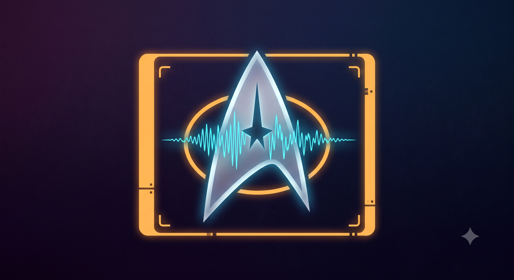

# Star-Trek Voyicer



Giving _Star Trek: Voyager_ the voice acting it never shipped with.

## Why this exists

When _Star Trek: Voyager_ came out, a lot of players expected the cast to actually
talk — full voice acting, like you'd get in a modern game. Instead the dialogue is
just text boxes. Voyicer is a fan-made companion app collection that fixes that after the fact:
it watches the game while you play, catches the dialogue as it appears on screen,
and reads it out loud in a voice cloned from the real character.

It's two small apps that work together:

- **`apps/jeanlucrecord`** — the "voice factory." You feed it a handful of real
  audio clips of a character, and it builds a small, fast text-to-speech model
  that sounds like them.
- **`apps/janewav`** — the "companion." This is what actually runs next to the
  game. It watches the dialogue box, reads what's on screen, and speaks it using
  whichever character's voice model matches the speaker.

Voices are built once per character and reused forever after — the game-time app
never has to do anything as slow or heavy as AI voice cloning live; it just plays
a tiny pre-built model.

## Current status: screen reading is manual (for now)

Right now, `janewav` speaks a line when you **right-click** while a dialogue box
is on screen — it grabs a screenshot, reads the text, and speaks it. That's a
placeholder, not the intended end state.

The plan is for it to poll the screen automatically on a timer, since Voyager's
dialogue "types out" one character at a time. Each successive screenshot will be
compared against a short history queue of what's already been read, so the app
recognizes "this is the same line, just further along" instead of re-reading (or
repeating) text as it types out. That auto-read/dedup logic isn't built yet —
right-click-to-speak is just the interim way to trigger it.

## Getting started (ELI5)

You don't need to know how any of the AI stuff works to run this. Here's the
whole path from "nothing installed" to "hearing Tuvok talk."

### 1. Install the tools

- **Python 3.12+**
- **[uv](https://docs.astral.sh/uv/)** — used to install each app's dependencies
- **Docker Desktop**, with NVIDIA GPU support enabled — only needed for building
  voice models (`jeanlucrecord`), not for running the game companion
- **[Tesseract OCR](https://github.com/tesseract-ocr/tesseract)** installed to
  its default Windows path — this is what reads the text out of the dialogue box
- An NVIDIA GPU. Voice model _building_ needs CUDA; the live companion app can
  use it too but doesn't strictly require it.

### 2. Get the dependencies installed

From the repo root:

```bash
just sync-all
```

This sets up both apps' virtual environments in one go.

### 3. Give it some reference clips of the character

This is the only "content" step you have to do by hand. For each character you
want a voice for, find a handful of **clean, short audio clips of them actually
talking** — ripped from the game, a show clip, wherever — and save them as
`.wav` files in:

```text
apps/jeanlucrecord/samples/<character>/
```

For example, clips of Tuvok go in `apps/jeanlucrecord/samples/tuvok/`. A few
short clips (a couple of sentences each) is plenty — the pipeline only uses
them as a reference for cloning the voice, not as training data itself.

Folders such as `chakotay`, `doctor`, `janeway`, `kim`, `paris`,
`sevenofnine`, `torres`, and `tuvok` — byo clips.

### 4. Build the voice model

Once a character has at least one `.wav` file in their `samples/` folder, run:

```bash
just generate-voice <character>
```

e.g. `just generate-voice doctor`. This is the slow, automated part — it will:

1. Use the reference clip(s) to clone the voice and generate ~1,500 spoken
   training phrases (double-checked with speech-to-text so bad generations get
   thrown out automatically)
2. Fine-tune a small, fast voice model from that generated dataset (this is the
   part that needs the GPU and Docker, and takes a while)
3. Export a ready-to-use model file

When it finishes, it prints the exact file paths to copy and which setting to
update — see the next step.

### 5. Install the model into the live app

Follow the copy/paste instructions printed at the end of step 4: copy the two
exported model files into `apps/janewav/src/models/`, then add the character to
the `MODELS` setting in `apps/janewav/src/.env`.

### 6. Run it alongside the game

```bash
just run-janewav
```

Start _Star Trek: Voyager_, play as normal, and right-click whenever a
character is talking to hear their line read aloud. `Ctrl+Alt+Shift+Q` quits
the companion app.

## Credits

The character voice model training pipeline (Chatterbox for voice cloning +
fine-tuning a [Piper](https://github.com/rhasspy/piper) model from the
generated dataset) is adapted from Cal Bryant's article,
["Training a new AI voice for Piper TTS with only 4 words"](https://calbryant.uk/blog/training-a-new-ai-voice-for-piper-tts-with-only-4-words/).
Full credit to the author for working out the approach; this project just
points it at _Star Trek: Voyager_'s cast.

## A note on how this was built

This app was written entirely by hand, without AI assistance — with one
exception: portions of the voice model training pipeline were adapted from the
technique in the article linked above.

As this is my first public py app I am very much open to feedback. Attempted to follow pep8 as closely as possible. Should have done this way sooner. C# and TS are just way too verbose and heavy-handed to accomplish the same thing in either.
